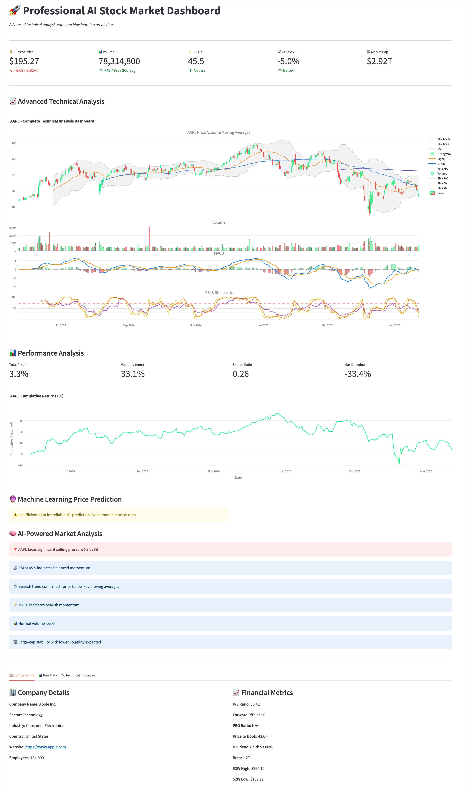
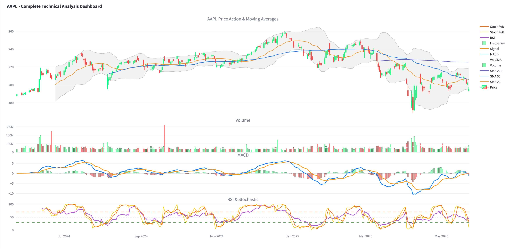
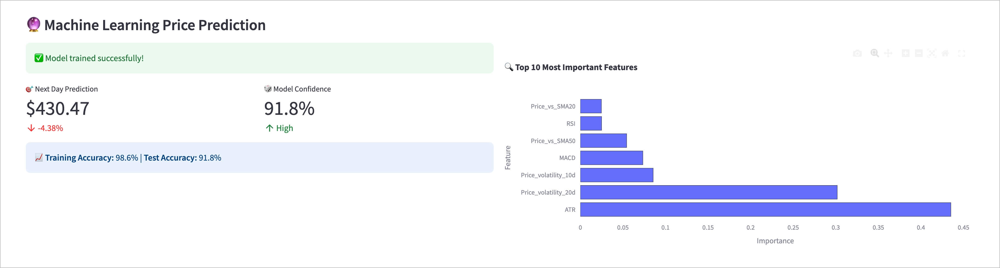
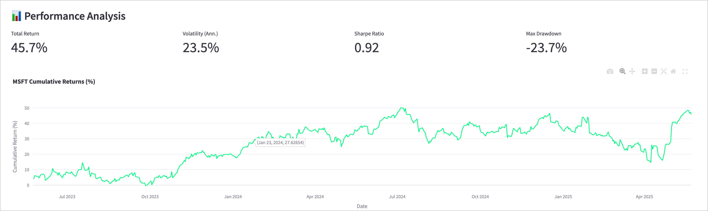
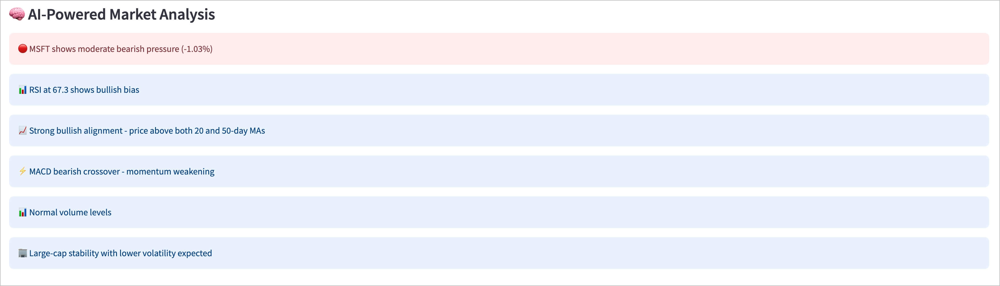
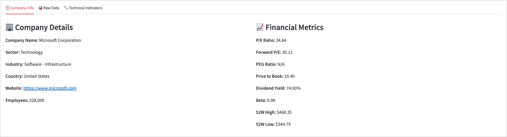

# 🚀 AI-Powered Stock Market Dashboard

[](https://www.python.org/)
[](https://streamlit.io/)
[](LICENSE)

> **Professional-grade stock analysis with machine learning predictions and real-time technical indicators**

A comprehensive, AI-powered stock market dashboard that combines advanced technical analysis, machine learning price predictions, and intelligent market insights in a beautiful, interactive interface.



## ✨ Features

### 🤖 **Artificial Intelligence**
- **Machine Learning Price Prediction** - Random Forest model with 30+ technical features
- **AI Market Analysis** - Natural language insights based on technical indicators
- **Feature Importance Analysis** - Understand what drives price movements
- **Model Performance Metrics** - Train/test accuracy with confidence levels

### 📈 **Advanced Technical Analysis**
- **Professional Charts** - Multi-panel candlestick charts with technical overlays
- **20+ Technical Indicators** - RSI, MACD, Bollinger Bands, Moving Averages, Stochastic
- **Volume Analysis** - Volume trends and confirmation signals
- **Performance Metrics** - Sharpe ratio, volatility, maximum drawdown

### 🎯 **Real-Time Data**
- **Live Stock Data** - Real-time prices from Yahoo Finance
- **Multiple Timeframes** - 1M to 5Y analysis periods
- **Popular Stock Presets** - Quick access to FAANG+ stocks
- **Custom Symbol Input** - Analyze any publicly traded stock

### 🎨 **Professional Interface**
- **Dark Theme** - Easy on the eyes for extended analysis
- **Responsive Design** - Works perfectly on desktop and mobile
- **Interactive Charts** - Zoom, pan, and explore data
- **Organized Tabs** - Clean separation of different analysis types



## 🚀 Quick Start

### Prerequisites

```bash
Python 3.8 or higher
```

### Installation

1. **Clone the repository**
```bash
git clone https://github.com/aloocoder/Ai-Stock-Dashboard.git
cd Ai-Stock-Dashboard
```

2. **Install dependencies**
```bash
pip install -r requirements.txt
```

3. **Run the application**
```bash
streamlit run stock_dashboard.py
```

4. **Open your browser**
```
Navigate to http://localhost:8501
```



## 📦 Dependencies

```
streamlit>=1.28.0
yfinance>=0.2.18
pandas>=1.5.0
numpy>=1.24.0
plotly>=5.15.0
scikit-learn>=1.3.0
```

## 🎮 How to Use

### 1. **Select Your Stock**
- Choose from popular presets (Apple, Tesla, Google, etc.)
- Or enter any stock symbol manually
- Select your preferred analysis timeframe

### 2. **Explore the Analysis**
- **Main Dashboard**: Key metrics and price changes
- **Technical Charts**: Advanced multi-panel analysis
- **Performance**: Risk metrics and cumulative returns
- **AI Predictions**: Machine learning price forecasts
- **Market Analysis**: AI-generated insights

### 3. **Understand the Insights**
- 🟢 **Green indicators**: Bullish signals
- 🔴 **Red indicators**: Bearish signals  
- 🟡 **Yellow indicators**: Neutral/mixed signals
- ⚠️ **Warning indicators**: Overbought/oversold conditions



## 🧠 Machine Learning Model

Our AI uses a **Random Forest Regressor** trained on 30+ features including:

- **Price-based features**: Returns, volatility, price changes
- **Technical indicators**: RSI, MACD, moving averages
- **Volume features**: Volume ratios and trends  
- **Lag features**: Historical price and volume data
- **Statistical features**: Rolling means and standard deviations

**Model Performance:**
- Real-time training on historical data
- Cross-validation with train/test splits
- Feature importance analysis
- Confidence metrics displayed



## 📊 Technical Indicators

| Indicator | Purpose | Interpretation |
|-----------|---------|----------------|
| **RSI** | Momentum | >70 Overbought, <30 Oversold |
| **MACD** | Trend | Signal line crossovers |
| **Bollinger Bands** | Volatility | Price vs. bands position |
| **Moving Averages** | Trend | Price vs. MA relationships |
| **Stochastic** | Momentum | %K and %D oscillator |
| **Volume** | Confirmation | Volume vs. average ratios |

## 🎯 Use Cases

### 📈 **For Traders**
- Quick technical analysis of any stock
- AI-powered price predictions for next trading day
- Volume confirmation signals
- Multiple timeframe analysis

### 💼 **For Investors**
- Long-term performance metrics
- Risk assessment (volatility, drawdown)
- Company fundamental information
- Market trend analysis

### 🎓 **For Learning**
- Understanding technical indicators
- Machine learning in finance
- Market behavior patterns
- Professional chart analysis



## ⚠️ Disclaimer

**This tool is for educational and informational purposes only.**

- Not financial advice or investment recommendations
- Past performance doesn't guarantee future results
- Always do your own research before investing
- Consider consulting with financial professionals
- Markets involve risk and potential loss of capital


## 📝 License

This project is licensed under the MIT License - see the [LICENSE](LICENSE) file for details.

## 🌟 Acknowledgments

- **Yahoo Finance** for providing free stock data
- **Streamlit** for the amazing web framework
- **Plotly** for interactive visualizations
- **scikit-learn** for machine learning capabilities
